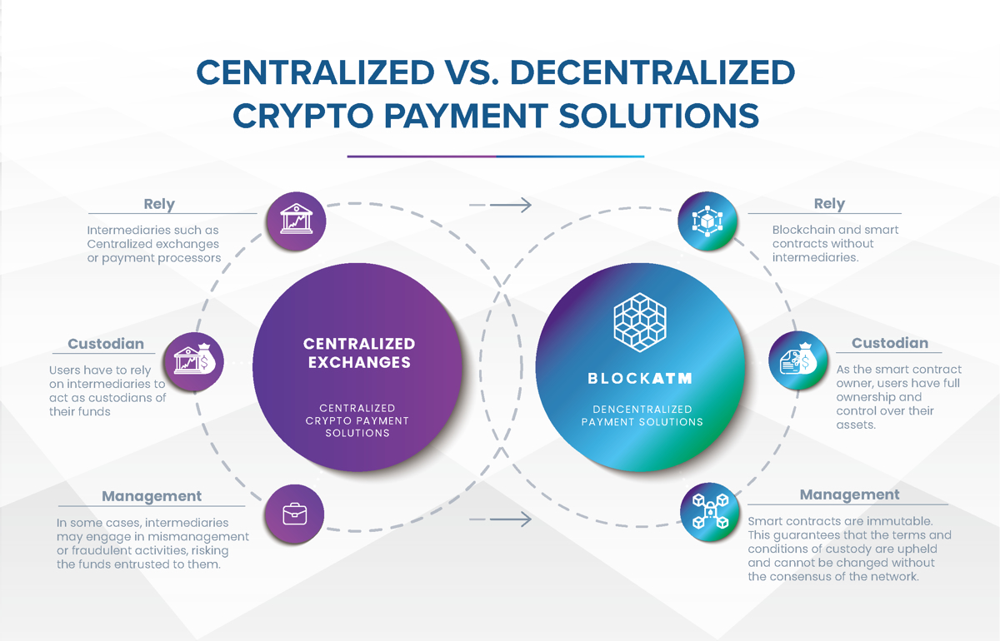
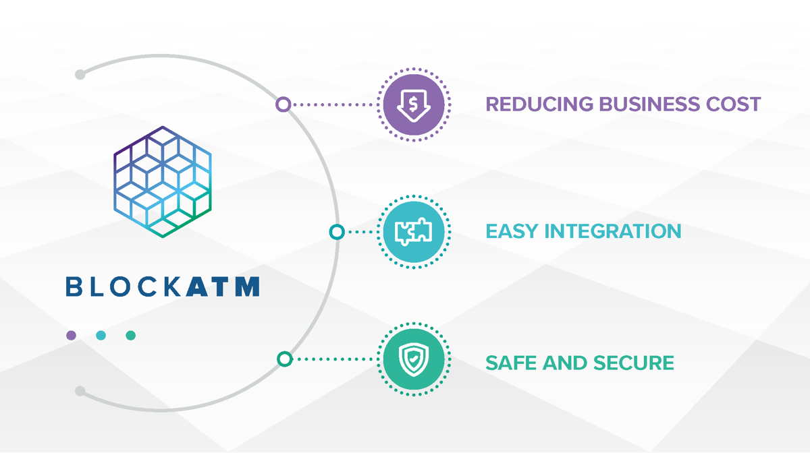

# 概览

### 欢迎

Welcome to BlockATM API Documentation! BlockATM offers a set of powerful and flexible APIs that allow developers to integrate seamless cryptocurrency payment services into their applications.

### About BlockATM

\
BlockATM is a decentralized payment solution for crypto, aimed at providing a secure, convenient, and trustworthy payment platform. With our use of Web3 technology and smart contracts, we manage every transaction to ensure its authenticity. Our mission is to leverage the benefits of decentralization, such as tamper-proof and trustworthy systems, to ensure the safety of your assets.
We believe that trust can be established without the need for verification, and thus, BlockATM aims to make crypto payments more secure and reliable through decentralized solutions.

### Our Vision

\
At BlockATM, we are committed to leveraging the power of blockchain technology to create a more efficient and transparent payment ecosystem for businesses.
Our solutions will enable businesses to seamlessly integrate crypto into their existing payment infrastructure, while also providing robust security features to protect against fraud and hacking.
###  Key Features

* Smart contracts are fully independently deployed

* 100% asset security

* Fully decentralized , not reliant on anyone including BlockATM

* All fees are written into smart contracts, ensuring transparency

* Easy and simple payment gateway integration with support for customization
