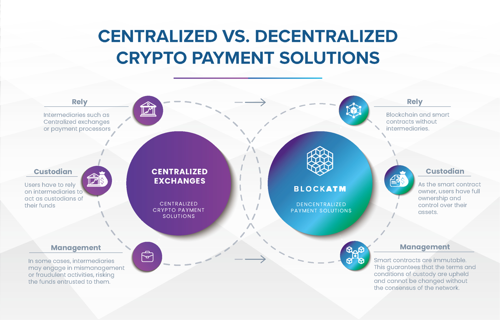
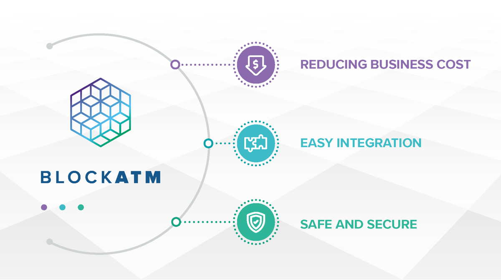
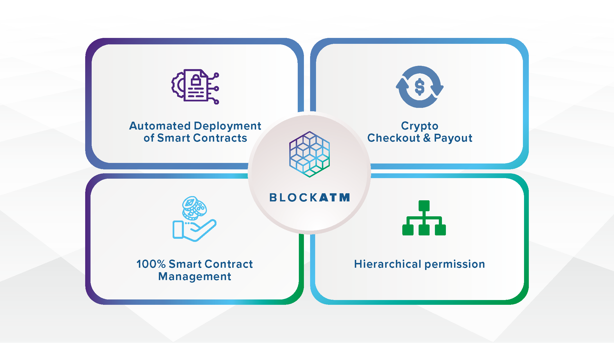

# 概览

### 欢迎

欢迎访问 BlockATM API 文档！我们提供强大灵活对接模式，助力开发者快速轻松集成加密货币支付服务。

BlockATM 致力于推动加密货币普惠化。通过我们精心设计的 API 接口和 Widget SDK，开发者可快速为应用程序集成加密货币支付功能。我们提供高度可定制的解决方案，满足各类业务场景需求。

### 关于BlockATM

BlockATM是一种去中心化的加密货币支付解决方案，致力于为用户提供一个安全、便捷、可信的支付平台。我们通过Web3技术和智能合约的应用，确保每一笔交易的真实性和可靠性。我们的使命是利用去中心化的优势，如防篡改和可信赖的系统，保障用户资产的安全。我们相信，信任无需通过验证即可建立，因此BlockATM旨在通过去中心化的解决方案，让加密货币支付变得更加安全可靠。

### 产品愿景

在BlockATM，我们致力于利用区块链技术的力量，为企业打造一个更高效、透明的支付生态系统。我们的解决方案将帮助企业无缝整合加密货币到其现有的支付基础设施中，同时提供强大的安全功能，有效防范欺诈和黑客攻击。

### 主要特性

- 智能合约完全独立部署
- 资产100%安全
- 权限完全去中心化，不依赖任何人包括Blockatm
- 所有费用写入智能合约，公开透明
- 收银台接入方便简单，支持自定义

### Jump right in

<table data-view="cards"><thead><tr><th></th><th></th><th data-hidden data-card-cover data-type="files"></th><th data-hidden></th><th data-hidden data-card-target data-type="content-ref"></th></tr></thead><tbody><tr><td><strong>Getting Started</strong></td><td>Create your first site</td><td></td><td></td><td><a href="getting-started/quickstart.md">quickstart.md</a></td></tr><tr><td><strong>Basics</strong></td><td>Learn the basics of GitBook</td><td></td><td></td><td><a href="broken-reference">Broken link</a></td></tr><tr><td><strong>Publish your docs</strong></td><td>Share your docs online</td><td></td><td></td><td><a href="getting-started/publish-your-docs.md">publish-your-docs.md</a></td></tr></tbody></table>
