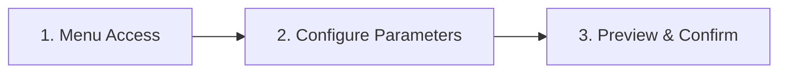

# Deposit Service

## 1. Deploy Payment Contract Setup Guide

### Step-by-Step Instructions

1. **Network Connection & Authorization**\
   Select the target blockchain network for wallet connection and complete authorization in your wallet interface.
2. **Navigate to Contract Creation**\
   Under `Receiving Contract` → `Payment Smart Contract` menu, click **Create New Payment Contract**.
3. **Contract Configuration**\
   Enter required parameters:
   * `Contract name` (alphanumeric only)
   * `Finance wallet address` (for fund management)
   * `Withdrawal wallet address` (must differ from finance address)
4. **Deployment Confirmation**\
   Click **Create** and sign the deployment transaction in your wallet:
   * Verify gas fee before signing
   * Keep wallet unlocked until confirmation

### Technical Notes

* **EVM Chains** (Ethereum/Arbtrium): Requires 0.05+ ETH  gas reserve
* **TRON**: Requires 500+ frozen TRX for bandwidth
* Contract parameters become immutable after deployment

### Create Payment Checkout Portal

1. **Access Creation Menu**\
   Navigate to **Checkout** in top menu → Click **Create New Checkout**
2. **Parameter Configuration**\
   Fill in the creation form:
   * `Checkout Name` (Displayed to customers)
   * `Business Logo` (Recommended 256x256px PNG)
   * `Network Selection` (Ethereum/BSC/TRON)
   * `Accepted Cryptocurrencies` (Multi-select supported)
   * `Payment Methods` (On-chain/Cross-chain)\
     &#xNAN;_&#x4C;ive preview updates automatically on right panel_
3. **Finalize Creation**\
   Click **Confirm** to generate:
   * Unique checkout URL
   * Embeddable widget code
   * API credentials

### Technical Specifications

| Field      | Requirements                         |
| ---------- | ------------------------------------ |
| Name       | 3-50 characters                      |
| Logo       | Max 2MB (Transparent BG recommended) |
| Networks   | Minimum 1 chain required             |
| Currencies | Must support at least 1 stablecoin   |

