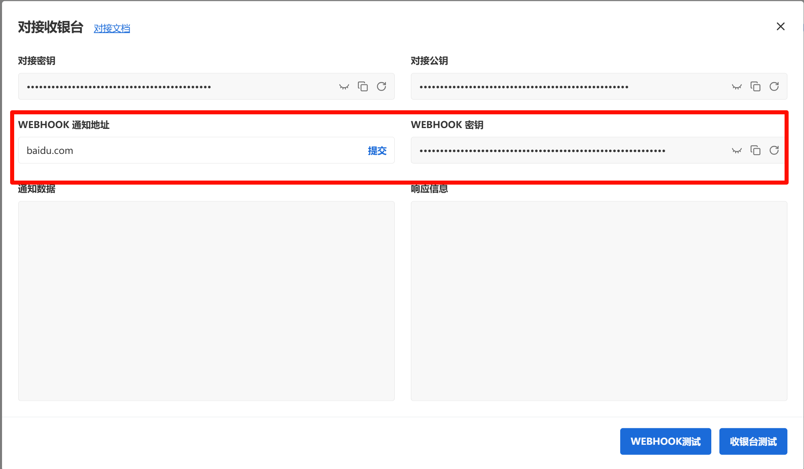

# Overview

Webhooks are necessary for behind-the-scenes transactions. With webhooks you can be notified about asynchronous changes to the status of transaction objects. BlockATM can send webhook events that notify your application anytime an event happens on your account. This is especially useful for events like transaction status updates, that are not triggered by a direct API request.\
It will be sent via an HTTP POST request to any endpoint URLs that you have defined in your account's Webhooks settings.


### Configuration Requirements

**Merchant Setup**:

* Set your webhook URL in Merchant Dashboard
* Retrieve your signature secret key from Dashboard > Security Settings

<figure><figcaption></figcaption></figure>

**Request Specification**:

```http
POST /your-endpoint HTTP/1.1
Host: your-server.com
Content-Type: application/json
BlockATM-Signature-V2: ab3d...
BlockATM-Request-Time: 1743060268000
BlockATM-Event: payment.success

{
  "cust_no": "evt_123456789",
  "order_no": "ORD202312345",
  "status": 9,
  "timestamp": 1743060268000
  ...
}
```

### Verification Headers

| Header                | Description                                                                             | Example       |
| --------------------- | --------------------------------------------------------------------------------------- | ------------- |
| BlockATM-Signature-V2 | HMAC-SHA256 signature of payload. [see detail.](../open-api/openapi/request-signing.md) | c3109d97...   |
| BlockATM-Request-Time | Unix timestamp (milliseconds)                                                           | 1743060268000 |
| BlockATM-Event        | Event type identifier                                                                   | payment       |

### Sample Response Handling

```python
@app.route('/webhook', methods=['POST'])
def handle_webhook():
    signature = request.headers.get('BlockATM-Signature-V2')
    timestamp = request.headers.get('BlockATM-Request-Time')
    event_type = request.headers.get('BlockATM-Event')
    
    # Verify request
    if not verify_request(signature, timestamp, request.data):
        return "Invalid request", 401
    
    # Process event
    if event_type == 'payment':
        handle_payment(request.json)
    elif event_type == 'payout':
        handle_payout(request.json)
        
    return "OK", 200
```


## Important Notes

* Ensure your Webhook URL uses HTTPS to guarantee data security.
* Your server must return an HTTP status code of 200 to confirm successful receipt of the Webhook.
* If a Webhook fails to deliver, BlockATM will retry, but it is recommended to log events for troubleshooting.
